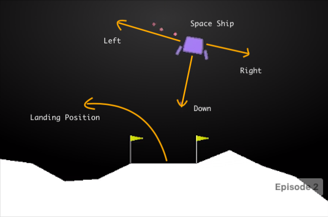

# Reinforcement-Learning---Lunar-Lander

### This project was completed in the KTH EL2805 Course (Reinforcement Learning). See the file instructions.pdf to get a full introduction of the problem and the details of the implemented algorithms.

In this lab we will solve a classical problem in optimal control theory: the lunar lander. The
environment is implemented in the OpenGym library3. The goal will be to train a network to make a successful landing on the
moon. \
Consider figure below: the goal is to manoeuvre the space ship so that it lands between the two flags. The landing pad is always at coordinates (0, 0). The coordinates are the first two numbers in the state vector. Reward for moving from the top of the screen to the landing pad and zero speed is about 100 ∼ 140 points. If the lander moves away from the landing pad it loses reward. The episode finishes if the lander crashes or comes to rest, receiving an additional −100 or +100 points. Each leg with ground contact is +10 points. Firing the main engine is −0.3 points each frame.
Firing the side engine is −0.03 points each frame. To consider the problem solved your policy
should achieve 200 points. Landing outside the landing pad is possible. Fuel is infinite, so an agent
can learn to fly and then land on its first attempt (in reality there is a limit of 1000 steps in each
episode, in order to limit simulation time).

The state of the problem s is an 8-dimensional variable: s1 and s2 are respectively position in the
x axis and y axis; s3 and s4 are the x, y axis velocity terms; s5, s6 are the lander angle and angular
velocity; s7 and s8 are the left and right contact points (boolean values; to indicate if the space
ship touched land). The action space, instead, can be discrete or continuous: \

 #### 1. Discrete action space.
 Four discrete actions are available: do nothing (0), fire left orientation
engine (1), fire main engine (2), fire right orientation engine (3). \

#### 2. Continuous action space.
In this case the action a is a 2-dimensional variable, whose values
are between −1 and 1. a1 controls the main engine: from −1 to 0 is off, from 0 to 1 throttles
from 50% to 100% of the power (engine can’t work with less than 50% power). a2 instead is
used to control direction: from −1 to −0.5 fires the left engine; from −0.5 to 0.5 is disabled;
from 0.5 to 1 fires the right engine.

